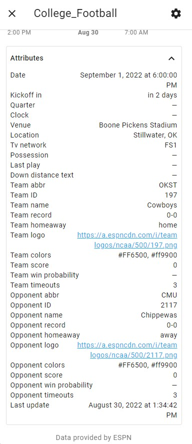
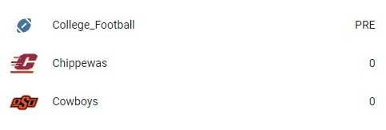

# Frontend Example
The goal is to eventually have a custom lovelace card to display the sensor's information. In the meantime, a makeshift scoreboard can be created using template sensors. Follow the steps below to get a result similar to this:

Attributes exposed:

 

When game is scheduled:

 


When a game is ongoing:


When a game is over:

## Configuration for Lovelace Card
**The below will only work on Home Assistant Core pre 2021.8.X:**

`configuration.yaml`

Change `sensor.college_football` to your sensor's `device_id`:
```
sensor:
  - platform: college_football
    team_id: #
  - platform: template
    sensors:
      cf_opponent_team:
        friendly_name_template: '{{ states.sensor.college_football.attributes.opponent_name }}'
        value_template: '{{ states.sensor.college_football.attributes.opponent_score }}'
        entity_picture_template: '{{ states.sensor.college_football.attributes.opponent_logo }}'
      cf_your_team:
        friendly_name_template: '{{ states.sensor.college_football.attributes.team_name }}'
        value_template: '{{ states.sensor.college_football.attributes.get("team_score", "-") }}'
        entity_picture_template: '{{ states.sensor.college_football.attributes.team_logo }}'
```
  
`ui-lovelace.yaml`

Change `sensor.college_football` to your sensor's `device_id`:
```
type: entities
show_header_toggle: false
entities:
  - entity: sensor.college_football
  - entity: sensor.cf_opponent_team
  - entity: sensor.cf_your_team
```

**The below will only work on Home Assistant Core 2021.8.X or later:**

`configuration.yaml`

Change `sensor.college_football` to your sensor's `device_id`:
```
template:
  - sensor:
    - unique_id: opponent_team
      name: '{{ states.sensor.college_football.attributes.get("opponent_name", "") }}'
      state: '{{ states.sensor.college_football.attributes.get("opponent_score", "") }}'
      picture: '{{ states.sensor.college_football.attributes.get("opponent_logo", "") }}'
  - sensor:
    - unique_id: your_team
      name: '{{ states.sensor.college_football.attributes.get("team_name", "") }}'
      state: '{{ states.sensor.college_football.attributes.get("team_score", "") }}'
      picture: '{{ states.sensor.college_football.attributes.get("team_logo", "") }}'
```
  
`ui-lovelace.yaml`

Change `sensor.college_football` to your sensor's `device_id`:
```
type: entities
show_header_toggle: false
entities:
  - entity: sensor.college_football
  - entity: sensor.template_opponent_team
  - entity: sensor.template_your_team
```

